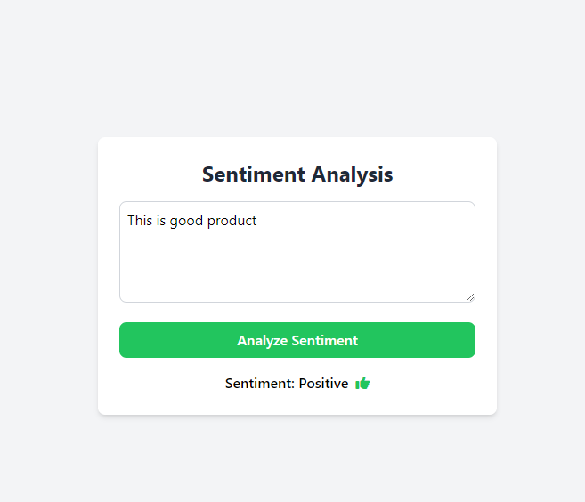

# Sentiment Analysis App

This is a simple sentiment analysis web application built using Flask, Python, and Tailwind CSS. The app allows users to input product reviews and receive sentiment predictions (positive or negative) along with visual feedback (thumbs up or thumbs down).

## Features

- **Text Input**: Users can enter their product reviews.
- **Sentiment Prediction**: The app analyzes the sentiment of the review using a Naive Bayes classifier.
- **Visual Feedback**: Displays thumbs up for positive sentiment and thumbs down for negative sentiment.
- **Responsive Design**: Styled with Tailwind CSS for a modern and responsive user interface.

## Requirements

- Python 3.x
- Flask
- scikit-learn
- pandas

## Installation

1. **Clone the Repository**:
   ```bash
    git clone <repository-url>
    cd sentiment-analysis-app
   ```

2. **Install Required Packages:** Create a virtual environment (optional but recommended) and install the required packages:

    ```bash
        python -m venv venv
        source venv/bin/activate   
        # On Windows use `venv\Scripts\activate`
        pip install Flask pandas scikit-learn
    ```

3. **Download the Dataset:** Ensure you have the Reviews.csv dataset in the project directory. You can find sample datasets online or create your own.

4.  **Train the Model:** Run the analyser.py script to train the sentiment analysis model and save it.

    ```bash 
    python analyser.py
    ```
5. **Run the Flask App:** After training, run the Flask application:

    ```bash 
    python app.py
    ```
6. **Access the Application:** Open your web browser and go to:

    ```bash
    http://127.0.0.1:5000/
    ```
## Usage

1. Enter a product review in the text area.
2. Click the "Analyze Sentiment" button.
3. The application will display the predicted sentiment along with a thumbs up or thumbs down icon.



## License

This project is licensed under the MIT License. See the [LICENSE](LICENSE) file for more information.

## Acknowledgments

- [Flask](https://flask.palletsprojects.com/) for web framework.
- [Tailwind CSS](https://tailwindcss.com/) for styling.
- [scikit-learn](https://scikit-learn.org/) for machine learning functionalities.
- [Font Awesome](https://fontawesome.com/) for icons.

## Contributing

Feel free to fork the repository and submit pull requests. Your contributions are welcome! 